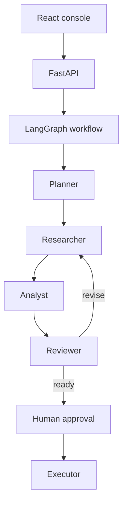

# Agentic AI Operations Hub

A full-stack LangGraph platform that turns a complex objective into an observable, approval-aware multi-agent workflow.

## Agents

- **Planner** decomposes the objective into concrete steps.
- **Researcher** gathers context with registered tools.
- **Analyst** converts findings into decisions and risks.
- **Reviewer** checks completeness and requests revisions.
- **Executor** prepares the final action only after human approval.

## Why this project stands out

- Explicit LangGraph state instead of an opaque agent loop
- Conditional routing and bounded revision cycles
- Human-in-the-loop approval before execution
- Run history and event timeline exposed through FastAPI
- React operations console for creating, inspecting, approving, and rejecting runs
- In-memory development store with a clear Redis/Postgres upgrade path
- Docker Compose, typed schemas, environment templates, and tests

## Architecture



## Quick start

```bash
cp .env.example .env
docker compose up --build
```

- Frontend: http://localhost:5174
- API docs: http://localhost:8001/docs

## Workflow API

| Method | Endpoint | Purpose |
|---|---|---|
| POST | `/api/runs` | Start an agent run |
| GET | `/api/runs/{id}` | Inspect state and timeline |
| POST | `/api/runs/{id}/approve` | Continue through approval |
| POST | `/api/runs/{id}/reject` | Stop with reviewer feedback |
| GET | `/health` | Service readiness |

## Portfolio talking points

This project demonstrates agent orchestration, durable state design, conditional edges, human approval, tool boundaries, structured LLM output, backend APIs, frontend observability, and production upgrade paths.
